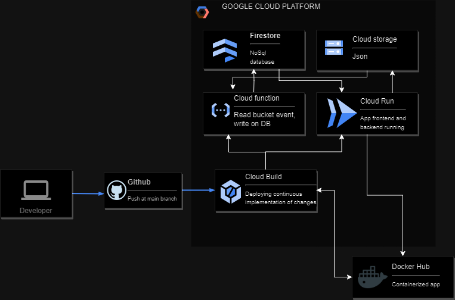
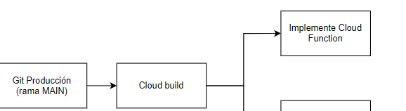

# GCP Architecture Development

In this set of exercises, we will explore the implementation of solutions in Google Cloud Platform (GCP), aiming to automate processes related to the storage, processing, and visualization of user information.


## Index

1. [Exercise 1: Data Automation](#exercise-1:-data-automation-on-google-cloud-platform)
2. [Exercise 2: Creation of a Web Application](#exercise-2:-creation-of-a-web-application)
3. [Exercise 3: DockerHub and Cloud Run Execution](#exercise-3:-dockerhub-and-cloud-run-execution)


## Exercise 1: Data Automation on Google Cloud Platform
***


- [Project Creation](#project-creation)
- [Cloud Storage Creation in GCP](#cloud-storage-creation-in-gcp)
- [Firestore Creation](#firestore-creation)
- [Cloud Build Creation](#cloud-build-creation)
- [Creación de Cloud Function en GCP](#creacion-de-cloud-function-en-gcp)


### Project Creation

```bash
gcloud init
gcloud projects create  gcp-final-project
gcloud config set project gcp-final-project
gcloud services enable storage-api.googleapis.com

```

### Cloud Storage Creation in GCP
Create a bucket in Cloud Storage to store JSON files.

```bash
gsutil mb -l europe-west1 gs://bucket_formulariojson

```
### Firestore Creation

```bash
gcloud firestore databases create --region=europe-west2 (availability not present in Belgium)

response:
  '@type': type.googleapis.com/google.firestore.admin.v1.Database
  appEngineIntegrationMode: DISABLED
  concurrencyMode: PESSIMISTIC
  createTime: '2023-11-16T09:42:24.323077Z'
  deleteProtectionState: DELETE_PROTECTION_DISABLED
  earliestVersionTime: '2023-11-16T09:42:24.323077Z'
  etag: IKiEmLKdyIIDMIXcl7KdyIID
  keyPrefix: g
  locationId: europe-west2
  name: projects/gcp-final-project-405308/databases/(default)
  pointInTimeRecoveryEnablement: POINT_IN_TIME_RECOVERY_DISABLED
  type: FIRESTORE_NATIVE
  uid: 126c96a0-b2c6-452c-8c6b-8c6025a52aa7
  updateTime: '2023-11-16T09:42:24.323077Z'
  versionRetentionPeriod: 3600s
```

### Creación de Cloud Function en GCP
Create the function in CF that activates when a file is created or updated in CLoud Storage.

cli:
```bash
gcloud functions deploy function_proyectofinal_gcp \
  --region=europe-west1 \
  --runtime python39 \
  --trigger-bucket=gs://bucket_formulariojson \
  --source ./app \
  --allow-unauthenticated \
  --entry-point cloud_function_handler
```

main.py:
```python
import json
from google.cloud import storage
from google.cloud import firestore

db = firestore.Client()
try:
    db.collection('mi-ejercicio-gcp').add({})  # Puedes agregar un documento vacío si solo quieres crear la colección
    print("Colección 'mi-ejercicio-gcp' creada correctamente.")
except Exception as e:
    print(f"Error al crear la colección: {e}")

def function_proyectofinal_gcp(data, context):
    # Obtiene el nombre del bucket y la clave del archivo JSON del evento de GCS
    bucket = data['bucket']
    key = data['name']
    print(bucket)
    print(key)

    # Descarga el archivo JSON desde GCS
    bucket_obj = storage_client.get_bucket(bucket)
    blob = bucket_obj.blob(key)
    json_data = blob.download_as_text()

    # Parsea el JSON
    data = json.loads(json_data)

    # Inserta los datos en Firestore
    db.collection('mi-ejercicio-gcp').document().set({
        'ID': data['ID'],
        'Nombre': data['Nombre'],
        'Correo electrónico': data['Correo electrónico'],
        'Fecha de registro': data['Fecha de registro']
    })
```
### Cloud Build Creation
For continuous implementation of changes in the working repository, create a Cloud Build for deploying the Cloud Function.


```bash
gcloud services enable cloudresourcemanager.googleapis.com
gcloud services enable cloudfunctions.googleapis.com
gcloud auth application-default login
gcloud projects add-iam-policy-binding gcp-final-project-405308 --member="user:gcp-final-project-405308@appspot.gserviceaccount.com" --role=roles/cloudfunctions.functions.get


gcloud beta builds triggers create cloud-source-repositories \
    --repo=googlecloud_proyecto \
    --branch-pattern=main \
    --build-config=cloudbuild.yaml \
    --region=europe-west1

```
IMPORTANT TO ENABLE THE CLOUD FUNCTION DEVELOEPR ROLE AT THE CONSOLE


```yaml
steps:
  - name: 'gcr.io/cloud-builders/gcloud'
    args:
      - functions
      - deploy
      - function_proyectofinal_gcp
      - --region=europe-west1
      - --runtime
      - python39
      - --trigger-bucket
      - gs://bucket_formulariojson
      - --source=./app
      - --allow-unauthenticated
```

## Exercise 2: Creation of a Web Application
Creation of a web application to view the user database stored in FireStore and a web form for uploading files to cloud storage. Implementation of a navigation menu that allows access to the users colection and file uploads.

app.py:
```python
import json
from google.cloud import storage, firestore
from dash import Dash, dcc, html, dash_table
from dash.dependencies import Input, Output, State
import random
import datetime

# Create a Dash application
app = Dash(__name__, suppress_callback_exceptions=True)

# Create a GCS client
storage_client = storage.Client()

# Create a Firestore client
firestore_client = firestore.Client()

# Update the Firestore collection name
collection_name = 'mi-ejercicio-gcp'

today = datetime.date.today().strftime('%Y-%m-d')

# Function to get data from Firestore
def get_firestore_data():
    docs = firestore_client.collection(collection_name).stream()
    items = [doc.to_dict() for doc in docs]
    return items

# Define the overall layout of the application
app.layout = html.Div([
    html.H1('Navigation Menu'),  # Page title

    # Navigation menu
    dcc.Link('User Form', href='/form'),  # Link to the user form
    html.Br(),  # Line break
    dcc.Link('User Table', href='/user_table'),  # Link to the user table
    html.Br(),  # Line break

    # The content of the pages will be displayed here
    dcc.Location(id='url', refresh=False),
    html.Div(id='page-content')
])

# Callback to load the content of the pages
@app.callback(
    Output('page-content', 'children'),
    [Input('url', 'pathname')]
)
def display_page(pathname):
    if pathname == '/form':
        # If the user navigates to the form, display the form content
        return html.Div([
            html.H1('User Form'),
            dcc.Input(id='name', type='text', placeholder='Name', value=''),
            dcc.Input(id='email', type='email', placeholder='Email', value=''),
            html.Button('Submit', id='submit-button', n_clicks=0),
            html.Div(id='output-container-button', children='Hit the button to update.')
        ])
    elif pathname == '/user_table':
        # If the user navigates to the user table, display the content of the table
        data = get_firestore_data()
        return html.Div([
            html.H1('User Table'),
            dash_table.DataTable(
                columns=[{'name': key, 'id': key} for key in data[0].keys()],
                data=data
            )
        ])

# Route to handle form data submission
@app.callback(
    Output('output-container-button', 'children'),
    [Input('submit-button', 'n_clicks'),
    State('name', 'value'),
    State('email', 'value')]
)
def submit_form(n_clicks, name, email):
    if n_clicks > 0:  # Check if the "Submit" button has been clicked
        # Get data from the form
        user = {
            'ID': random.randint(100000, 999999),
            'Name': name,
            'Email': email,
            'Registration Date': today
        }
        # Save the data in Firestore
        firestore_client.collection(collection_name).add(user)
        return f'Data saved in Firestore: {user}'  # Provide a confirmation
    else:
        return 'Submit button has not been clicked yet'

if __name__ == '__main__':
    app.run_server(host='0.0.0.0', port=8080, debug=True)
```

## Exercise 3: DockerHub and Cloud Run Execution
***

dockerfile:
```bash
# Use an official Python runtime as a parent image
FROM python:3.9

# Set the working directory to /app
WORKDIR /app

# Copy the current directory contents into the container at /app
COPY . /app

# Copy requirements.txt to /app
COPY requirements.txt /app

# Install any needed packages specified in requirements.txt
RUN pip install --trusted-host pypi.org -r requirements.txt

# Make port 8080 available to the world outside this container
EXPOSE 8080

# Run app.py when the container launches
CMD ["python", "app/users.py"]
```

## 4. Set up cloudbuild.yaml for continious deployment

```bash
steps:
  - name: 'gcr.io/cloud-builders/gcloud'
    args:
      - functions
      - deploy
      - function_proyectofinal_gcp
      - --region=europe-west1
      - --runtime
      - python39
      - --trigger-bucket
      - gs://bucket_formulariojson
      - --source=./app
      - --allow-unauthenticated

  # Build and push to Docker Hub
  - name: 'gcr.io/cloud-builders/docker'
    args: ['build', '-t', 'docker.io/ocanha/app-users-gcp:$COMMIT_SHA', '.']
  
  - name: 'gcr.io/cloud-builders/docker'
    args: ['push', 'docker.io/ocanha/app-users-gcp:$COMMIT_SHA']


  # Deploy to Cloud Run using the image from Docker Hub
  - name: 'gcr.io/cloud-builders/gcloud'
    args:
      - 'run'
      - 'deploy'
      - 'nombre-del-servicio-cloud-run'
      - '--image=ocanha/app-users-gcp:$COMMIT_SHA'  # Use your Docker Hub image
      - '--platform=managed'
      - '--region=europe-west1'
      - '--allow-unauthenticated'

```

bugs and debugs:
 - 1
    error:
    Step #1: Already have image (with digest): gcr.io/cloud-builders/docker
    Step #1: unable to prepare context: unable to evaluate symlinks in Dockerfile path: lstat /workspace/Dockerfile: no such file or directory
    Finished Step #1
    ERROR
    ERROR: build step 1 "gcr.io/cloud-builders/docker" failed: step exited with non-zero status: 1

    Sove the following error putting the cloudbuild.yaml in the same jerarquy as the dockerfile.
 - 2 
    Starting Step #2
    Step #2: Already have image (with digest): gcr.io/cloud-builders/docker
    Step #2: The push refers to repository [docker.io/ocanha/app-users-gcp]
    Step #2: 7c8c7d5b118d: Preparing
    Step #2: d4544c1e6dbc: Preparing
    Step #2: de37a12b4574: Preparing
    Step #2: 07feef669b3a: Preparing
    Step #2: fa83a371445d: Preparing
    Step #2: 70866f64c03e: Preparing
    Step #2: 2d788bc47240: Preparing
    Step #2: 86e50e0709ee: Preparing
    Step #2: 12b956927ba2: Preparing
    Step #2: 266def75d28e: Preparing
    Step #2: 29e49b59edda: Preparing
    Step #2: 1777ac7d307b: Preparing
    Step #2: 70866f64c03e: Waiting
    Step #2: 2d788bc47240: Waiting
    Step #2: 86e50e0709ee: Waiting
    Step #2: 12b956927ba2: Waiting
    Step #2: 266def75d28e: Waiting
    Step #2: 1777ac7d307b: Waiting
    Step #2: 29e49b59edda: Waiting
    Step #2: denied: requested access to the resource is denied
    Finished Step #2
    ERROR
    ERROR: build step 2 "gcr.io/cloud-builders/docker" failed: step exited with non-zero status: 1

    >> Storing Docker credentials n Secret Manager https://cloud.google.com/build/docs/interacting-with-dockerhub-images#storing_docker_credentials_in
```bash
     steps:
 - name: 'gcr.io/cloud-builders/docker'
   entrypoint: 'bash'
   args: ['-c', 'docker login --username=$$USERNAME --password=$$PASSWORD']
   secretEnv: ['USERNAME', 'PASSWORD']
 - name: 'gcr.io/cloud-builders/docker'
   entrypoint: 'bash'
   args: ['-c', 'docker build -t $$USERNAME/app-users-gcp:$COMMIT_SHA .']
   secretEnv: ['USERNAME']
 - name: 'gcr.io/cloud-builders/docker'
   entrypoint: 'bash'
   args: ['-c', 'docker push $$USERNAME/app-users-gcp:$COMMIT_SHA']
   secretEnv: ['USERNAME']
 availableSecrets:
   secretManager:
   - versionName: projects/gcp-final-project-405308/secrets/docker-token/versions/DOCKER_PASSWORD_SECRET_VERSION
     env: 'PASSWORD'
   - versionName: projects/gcp-final-project-405308/secrets/docker-username/versions/DOCKER_USERNAME_SECRET_VERSION
     env: 'USERNAME'
     
```

# What is next?

